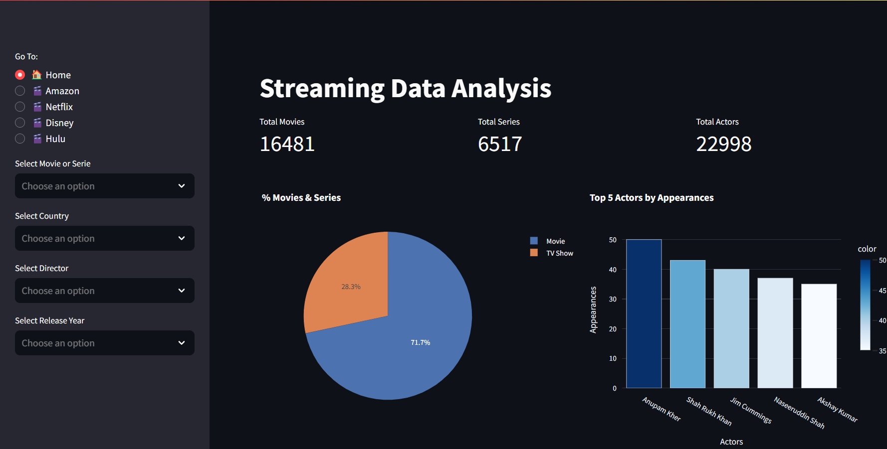

# Streaming-Dashboard-in-Streamlit

This project aims to demonstrate how to build a custom dashboard in Streamlit, using streaming data from:

- Amazon Prime
- Netflix
- Hulu
- Disney+

The dataset is sourced from Kaggle (available at this [link](https://www.kaggle.com/datasets/sc0v1n0/4-services-streaming-movies-and-tv)) and contains information about all films and TV series uploaded on these four streaming services from 2006 to 2021, with a total of 22,671 rows.

**Repository Structure**

The project repository is organized as follows:

```bash 
streamlit_test
│
├── .streamlit
│   └── config.yaml
│
├── my_pages
│   ├── home_page.py
│   ├── amazon.py
│   ├── hulu.py
│   ├── netflix.py
│   └── disney.py
│
├── all_streaming.csv
├── app.py
├── utils.py
├── LICENSE
└── README.md
 ```

**Application Overview**

This app features a home page that provides macro-level data for the four streaming services mentioned above. The home page includes:

Distribution of products by streaming channel
Global distribution of movies and TV series
Top 5 actors by appearances
Top 5 countries by number of products made
Additionally, each streaming service has its own dedicated page, where users can explore:

The number of movies and TV series added to the platform over time
The distribution of movies and TV series on the platform
The top 5 actors by appearances
The top 5 countries by the number of movies and TV series
distribution of movies and tv-series inside the platform, top 5 actors by appearances, and Top 5 Country by number of movies and series.

